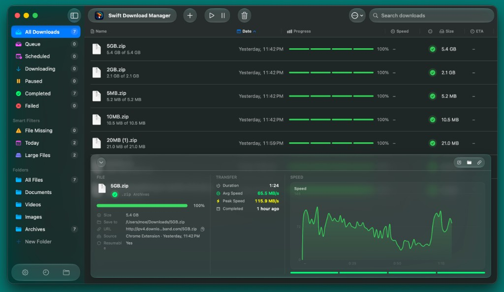
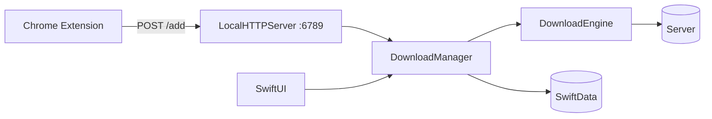

<p align="center">
  
</p>

<h1 align="center">Swift Download Manager</h1>

<p align="center">
  A native macOS download manager with multi-segment downloads, live speed charts, and a Chrome companion extension.
</p>

<p align="center">
  <a href="https://github.com/isthismarvin/SwiftDownloadManager/releases/latest"></a>
  <a href="LICENSE"></a>
  <a href="https://github.com/isthismarvin/SwiftDownloadManager/actions/workflows/ci.yml"></a>
  
  
</p>

<p align="center">
  <a href="https://github.com/isthismarvin/SwiftDownloadManager/releases/latest"><strong>Download latest release</strong></a>
  ·
  <a href="#features">Features</a>
  ·
  <a href="#installation">Installation</a>
  ·
  <a href="#usage">Usage</a>
  ·
  <a href="#development">Development</a>
</p>

<p align="center">
  
  <br>
  <sub>Download list, smart filters, and the three-column inspector with live speed chart.</sub>
</p>

---

Swift Download Manager replaces the browser download bar with a proper queue on your Mac: parallel segments, confirmations, domain rules, and optional Chrome hand-off — without leaving the native UI.

## Table of Contents

- [Features](#features)
- [Installation](#installation)
- [Usage](#usage)
- [How it works](#how-it-works)
- [Requirements](#requirements)
- [Development](#development)
- [Documentation](#documentation)
- [Contributing](#contributing)
- [License](#license)

## Features

**Downloads**
- Multi-segment HTTP downloads for higher throughput
- Pause, resume, schedule, and limit concurrent downloads
- Live speed chart, ETA, and per-segment progress in the inspector
- Optional confirm-before-start and summary-after-finish dialogs
- Rename, overwrite, or ask on filename conflicts

**Organization**
- Sidebar filters: queue, scheduled, active, completed, failed, and smart filters (missing file, today, large files)
- Library categories and custom folders
- Searchable download history

**Integration**
- **Chrome extension** — send links and capture browser downloads to the app (`127.0.0.1:6789`)
- Domain rules: auto-start, always ask, or block per host
- Drag & drop URLs, clipboard paste, and `swiftdownloadmanager://` deep links
- Global speed limits and optional Wi‑Fi-only starts

**macOS native**
- Security-scoped bookmarks for custom save folders
- Notifications, Dock badge, German & English UI

## Installation

**[→ Go to Releases](https://github.com/isthismarvin/SwiftDownloadManager/releases/latest)**

App and Chrome extension share the same version (**v2.0.2**).

| Asset | Download |
|-------|----------|
| macOS app (recommended) | [SwiftDownloadManager-macOS-v2.0.2.dmg](https://github.com/isthismarvin/SwiftDownloadManager/releases/latest/download/SwiftDownloadManager-macOS-v2.0.2.dmg) |
| macOS app (zip) | [SwiftDownloadManager-macOS-v2.0.2.zip](https://github.com/isthismarvin/SwiftDownloadManager/releases/latest/download/SwiftDownloadManager-macOS-v2.0.2.zip) |
| Chrome extension | [SwiftDownloadManager-ChromeExtension-v2.0.2.zip](https://github.com/isthismarvin/SwiftDownloadManager/releases/latest/download/SwiftDownloadManager-ChromeExtension-v2.0.2.zip) |

### macOS app

1. Download the **DMG** (or ZIP) from [Releases](https://github.com/isthismarvin/SwiftDownloadManager/releases).
2. Move **Swift Download Manager** to **Applications**.
3. **First launch:** if macOS blocks the app (not notarized yet), right-click → **Open** → confirm once.

   ```bash
   # Optional: clear quarantine flag
   xattr -cr /Applications/SwiftDownloadManager.app
   ```

Requires **macOS 26.0** (Tahoe) or later.

### Chrome extension

The companion extension talks to the app over localhost. **The app must be running.**

1. Download and unzip [SwiftDownloadManager-ChromeExtension-v2.0.2.zip](https://github.com/isthismarvin/SwiftDownloadManager/releases/latest/download/SwiftDownloadManager-ChromeExtension-v2.0.2.zip).
2. Launch Swift Download Manager.
3. In Chrome: `chrome://extensions` → **Developer mode** → **Load unpacked** → select the unzipped folder.
4. Pin the extension. A green **✓** badge means the app is connected.

<details>
<summary><strong>Extension troubleshooting</strong></summary>

| Problem | What to check |
|---------|---------------|
| Gray **–** badge / offline | App is running; **Settings → Integration** shows port `6789` |
| Download not appearing | Confirmation dialog enabled? Check domain rules |
| After an update | Remove old unpacked extension, load the new folder again |

→ [docs/CHROME_EXTENSION.md](docs/CHROME_EXTENSION.md)

</details>

## Usage

1. **Add** — **⌘N**, **⇧⌘V**, drag & drop, Chrome extension, or deep link.
2. **Confirm** — filename, folder, connections; start now or queue.
3. **Manage** — pause/resume, search, inspect speed graph and segments (**⌘I**).
4. **Configure** — **⌘,** for speed limits, domain rules, connections by file size, notifications.

### Keyboard shortcuts

| Shortcut | Action |
|----------|--------|
| **⌘N** | Add download |
| **⇧⌘V** | Add from clipboard |
| **⌘F** | Search |
| **Space** | Pause / resume |
| **⌘I** | Toggle inspector |
| **⌘,** | Settings |

<details>
<summary><strong>More shortcuts & deep links</strong></summary>

| Shortcut | Action |
|----------|--------|
| **⌘R** | Resume selected |
| **⌘.** | Cancel selected |
| **⌘⌫** | Delete selected |

Deep link:

```
swiftdownloadmanager://?url=https://example.com/file.zip
```

</details>

## How it works



<details>
<summary><strong>Architecture & tech stack</strong></summary>

| Layer | Technology |
|-------|------------|
| UI | SwiftUI, `NavigationSplitView` |
| State | `@Observable`, SwiftData `@Query` |
| Persistence | SwiftData |
| Settings | UserDefaults via `AppSettings` |
| Networking | URLSession (`DownloadEngine`) |
| Extension | Chrome MV3 + loopback HTTP |

→ [docs/ARCHITECTURE.md](docs/ARCHITECTURE.md)

</details>

## Requirements

| | |
|---|---|
| **macOS** | 26.0+ (Tahoe) |
| **Chrome** | Latest (for extension) |
| **Developers** | Xcode 26+ (macOS 26 SDK); Xcode 27 recommended |

## Development

```bash
git clone https://github.com/isthismarvin/SwiftDownloadManager.git
cd SwiftDownloadManager
open SwiftDownloadManager.xcodeproj   # ⌘R to run
./scripts/run-tests.sh
```

<details>
<summary><strong>Build, release, lint, project layout</strong></summary>

**Build**

```bash
xcodebuild -scheme SwiftDownloadManager -destination 'platform=macOS' -configuration Debug build
```

**Release**

```bash
./scripts/build-release.sh
```

Bump version in: `MARKETING_VERSION`, `ChromeExtension/manifest.json`, `AppConstants.chromeExtensionVersion`.

**Lint**

```bash
swiftlint
swiftformat --lint .
```

**Layout**

```
SwiftDownloadManager/
├── SwiftDownloadManager/   # App (Core, Views, ViewModels, …)
├── ChromeExtension/        # Extension source
├── tests/                  # Unit tests
├── scripts/                # build-release.sh, run-tests.sh
└── docs/                   # Architecture, extension docs
```

</details>

## Documentation

| Document | Description |
|----------|-------------|
| [docs/ARCHITECTURE.md](docs/ARCHITECTURE.md) | Layers, data flow |
| [docs/CHROME_EXTENSION.md](docs/CHROME_EXTENSION.md) | Extension protocol & dev setup |
| [CONTRIBUTING.md](CONTRIBUTING.md) | PR guidelines |
| [tests/README.md](tests/README.md) | Test details |

## Contributing

Contributions welcome — read [CONTRIBUTING.md](CONTRIBUTING.md) and [CLA.md](CLA.md) first.

1. Fork → feature branch → `./scripts/run-tests.sh` + `swiftlint` → PR against `main`

## License

Source available — not MIT/GPL. See [LICENSE](LICENSE) · [TRADEMARK.md](TRADEMARK.md) · Copyright (c) 2026 Marvin

| | |
|---|---|
| View, study, private build | ✅ |
| Pull requests ([CLA](CLA.md)) | ✅ |
| Redistribute or commercial use | ❌ without permission |
