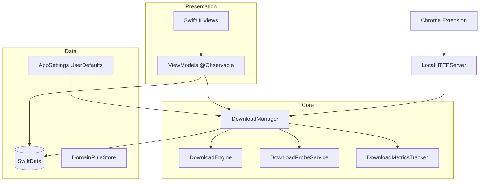

# Architecture

Swift Download Manager follows **MVVM** with a singleton orchestration layer and SwiftData for persistence.

## Layers

## DownloadManager

`DownloadManager` is the central coordinator. It is split into extensions for maintainability:

| File | Responsibility |
|------|----------------|
| `DownloadManager.swift` | Properties, setup, metrics |
| `DownloadManager+Receive.swift` | Incoming URLs, confirmation, probing |
| `DownloadManager+Lifecycle.swift` | Start, pause, cancel, delete, post-download |
| `DownloadManager+FoldersHistory.swift` | Folders, history, queue processing |
| `DownloadManager+EngineEvents.swift` | URLSession event handling |
| `DownloadManager+Persistence.swift` | Debounced SwiftData saves, progress cache |

## State Management

| Pattern | Usage |
|---------|--------|
| `@Observable` + `@Bindable` | View models, `AppSettings`, `DownloadManager` |
| `@Query` | SwiftData lists in views |
| `@State` | Local UI (column widths, hover, sheet fields) |
| Singletons | `DownloadManager.shared`, `AppSettings.shared` |

Language changes refresh views via `let _ = appSettings.appLanguage` in root views.

## Download Flow

1. **Receive** — URL from toolbar, clipboard, drag & drop, extension, or URL scheme
2. **Probe** — `DownloadProbeService` fetches HEAD metadata (size, resume support, filename)
3. **Confirm** — optional dialog (`DownloadConfirmationView`) based on settings/domain rules
4. **Queue** — `processQueue()` respects `maxConcurrentDownloads` and deferred start (schedule, Wi‑Fi)
5. **Engine** — `DownloadEngine` runs segmented URLSession downloads with speed limiting
6. **Persist** — progress debounced to SwiftData; live UI reads `DownloadMetricsTracker`
7. **Complete** — optional completion dialog, notifications, post-download actions

## Settings

All user preferences live in **`AppSettings`** (UserDefaults), including:

- Sort order, concurrent downloads, global speed limit
- Dialog behavior, conflict policy, notifications
- Language, inspector collapse state

`resetAllSettings()` clears AppSettings keys plus `DomainRuleStore` and `RecentDestinationsStore`.

## Sandbox

The app runs in App Sandbox with:

- Network client + local server (extension)
- Downloads folder + user-selected folders (bookmarks)
- Security-scoped access held for active downloads

## Localization

- **Runtime:** `L10n.t(de:en:)` and `L10n.catalog()` reading `Localizable.xcstrings`
- **Language:** `AppSettings.appLanguage` (system / German / English)

## Testing Strategy

| Type | Location | How to run |
|------|----------|------------|
| Unit | `tests/` | `./scripts/run-tests.sh` |
| Engine smoke | `smoke/` | Manual (see tests/README.md) |
| UI | — | Manual / future XCTest |

Unit tests compile selected sources with `swiftc` and lightweight stubs (`tests/TestStubs.swift`) — no full app graph required.
